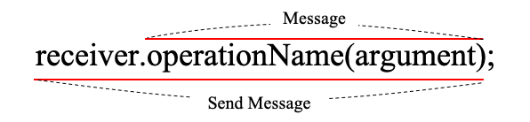
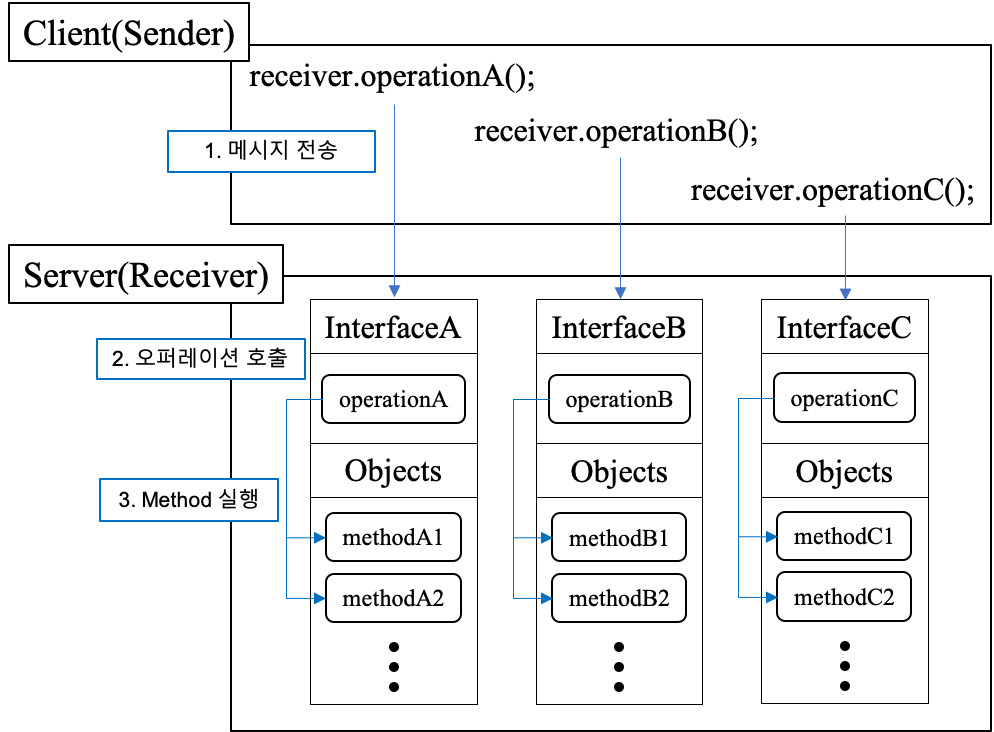

# 메시지와 인터페이스

## 메시지
- 객체들이 협력하기 위해 사용할 수 있는 유일한(?) 의사소통 수단이다.



### 메시지와 메서드를 구분하자


- 코드 상에서 동일한 메시지를 전송하더라도 객체의 타입에 따라 실행되는 메서드가 달라질 수 있다.
- 실행 시점(Runtime)에서 응답할 수 있는 객체가 존재하고, 그 객체가 적절한 메서드를 선택하여 응답할 것이라고 믿음
- 장점
  - 메시지에 대한 상세내용을 알 필요없이 메시지만 처리하면 되기 때문에 메시지 전송자와 메시지 수신자가 느슨하게 결합될 수 있다.
  - 메시지 수신자는 메시지를 처리하기 위해 필요한 메서드를 스스로 결정할 수 있는 자율권을 누린다.

### public interface, operation
- public interface: 객체가 의사소통을 위해 외부에 공개하는 메시지의 집합
- operation
  - public interface에 포함된 메시지
  - 수행 가능한 어떤 행동에 대한 **추상화**
  - 메서드는 **operation을** 구현한 것

### 시그니처
- 인터페이스의 개념과 조금 헷갈림

## 훌륭한 인터페이스의 공통적인 특징

### 디미터 법칙 (Low of Demeter)
- 객체의 내부 구조에 강하게 결합되지 않도록 협력 경로를 제한하라
- 자바의 경우에서는 도트(.) 하나만 사용해라
- 수신자(Receiver) 예시
  - this 객체
  - 메서드의 매개변수
  - this의 속성
  - this의 속성인 컬랙션의 요소
  - 메서드 내에서 생성된 지역 객체
- shy code
  - 불필요한 어떤 것도 다른 객체에게 보여주지 않으며, 다른 객체의 구현에 의존하지 않는 코드를 말한다.
  - 메시지 수신자의 내부 구조가 전송자에게 노출되지 않으며, 메시지 전송자는 수신자의 내부 구현에 결합되지 않는다. => **캡슐화?**
- 디미터 법칙과 캡슐화
  - 캡슐화: 클래스 내부의 구현을 감춘다는 사실 강조
  - 디미터 법칙: 협력하는 클래스의 캡슐화를 지키기 위해 접근해야 하는 요소를 제한

### 묻지 말고 시켜라
- 객체에 상태에 관해 묻지 말고 원하는 것을 시키는 메시지를 작성하라
> 절차적인 코드는 정보를 얻은 후에 결정한다.
> 객체지향 코드는 객체에게 그것을 하도록 시킨다!

- 장점
  - 밀접하게 연관된 정보화 행동을 함께 가지는 객체를 만들 수 있다.
  - 객체의 정보를 이용하는 행동을 객체의 외부가 아닌 내부에 위치시키기 때문에 자연스럽게 정보와 행동을 동일한 클래스 안에 두게 된다.
  - 자연스럽게 정보 전문가에게 책임을 할당하게 되고 높은 응집도를 가진 클래스를 얻을 확률이 높아진다.

### 의도를 드러내는 인터페이스
- '어떻게'가 아니라 '무엇'을 하는지 드러내도록 메서드 이름을 짓자
- 의도를 드러내는 선택자, 의도를 드러내는 인터페이스
  - 구현과 관련된 모든 정보를 캡슐화하고 객체의 퍼블릭 인터페이스에는 협력과 관련된 의도만을 표현해야 한다.
> 수행 방법에 관해서는 언급하지 말고 결과와 목적만을 포함하도록 클래스와 오퍼레이션의 이름을 부여하라 <br>
> 의도를 표현하는 추상적인 인터페이스 뒤로 모든 까다로운 매커니즘을 캡슐화해야 한다.
- 객체에게 묻지 말고 시키되 구현 방법이 아닌 클라이언트의 의도를 드러내야 한다.

### 디미터 법칙을 위반하는 1장의 티켓 판매 도메인
- 1장의 코드 리팩토링
```java
public class TicketSeller {
    private TicketSeller ticketSeller;
    
    public Theater(TicketSeller ticketSeller) {
        this.ticketSeller = ticketSeller;
    }

    public void enter(Audience audience) {
        if (audience.getBag().hasInvitation()) {
            Ticket ticket = ticketSeller.getTicketOffice().getTicket();
            audience.getBag().setTicket(ticket);
        } else {
            Ticket ticket = ticketSeller.getTicketOffice().getTicket();
            audience.getBag().minusAmount(ticket.getFee());
            ticketSeller.getTicketOffice().plusAmount(ticket.getFee());
            audience.getBag().setTicket(ticket);
        }
    }
}
```

## 원칙의 함정

### 디미터 법칙은 하나의 도트(.)를 강제하는 규칙이 아니다
- 기차 충돌처럼 보이는 코드라도 객체의 내부 구현에 대한 어떤 정보도 외부로 노출하지 않는다면 그것은 디미터 법칙을 준수한 것임

```java
IntStream.of(1, 15, 30, 3, 9).filter(x -> x > 10).distinct().count();
```
### 명령-쿼리 분리
- 
